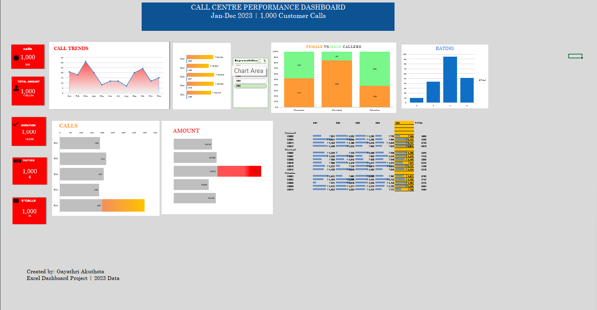
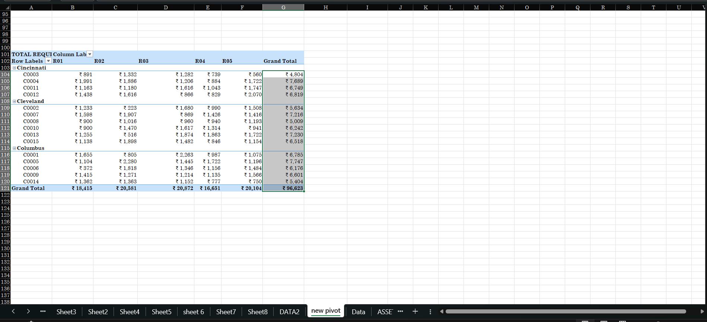
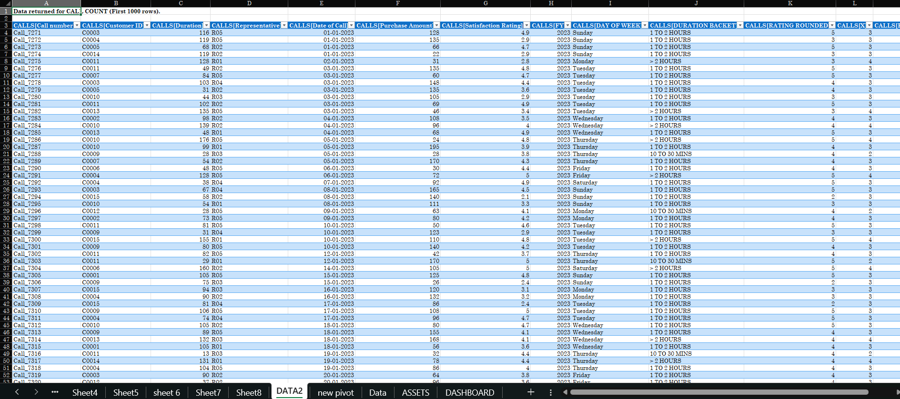

# 📊 Call Centre Performance Dashboard
**Tool:** Microsoft Excel | **Dataset:** 1,000 Customer Calls | **Year:** 2023

---

## 📌 Project Overview
An interactive Excel dashboard analyzing 1,000 call centre records to track
call trends, revenue, customer satisfaction, and representative performance
— all in one executive-level view.

---

## 📸 Dashboard Preview

---

## ✅ Features Built
- 📈 Call Trends Analysis (Jan–Dec 2023)
- 💰 Revenue / Amount Analysis
- ⭐ Customer Rating Analysis
- 👤 Representative Performance (Calls + Revenue)
- 🚻 Female vs Male Caller Analysis
- 🎛️ Interactive Slicers
- 🔢 KPI Cards (Calls, Amount, Rating, Duration)

---

## 🛠️ Excel Skills Used
- Pivot Tables & Pivot Charts
- Interactive Slicers (connected to all pivots)
- KPI Cards with dynamic values
- Conditional Formatting
- Data Cleaning & Feature Engineering
- Dashboard Design & Layout

---

## 📁 Files in This Repository
| File | Description |
|------|-------------|
| `CallCentre_Dashboard.xlsx` | Main Excel dashboard file |
| `dashboard_overview.png` | Full dashboard screenshot |
| `pivot_analysis.png` | Pivot table screenshot |
| `raw_data.png` | Raw dataset preview |

---

## 📌 Data Source
Dataset provided by Chandoo.org for educational purposes.
Dashboard, analysis, pivot tables, and visualizations
built independently by Gayathri A.

---

## 👩‍💻 Author
**Gayathri A**  
B.Tech – Artificial Intelligence & Data Science  
Dhanalakshmi Srinivasan University, Trichy | CGPA: 8.87  
📧 gayathriakuthota110@gmail.com  
🐙 GitHub: [Gayithri1509](https://github.com/Gayithri1509)